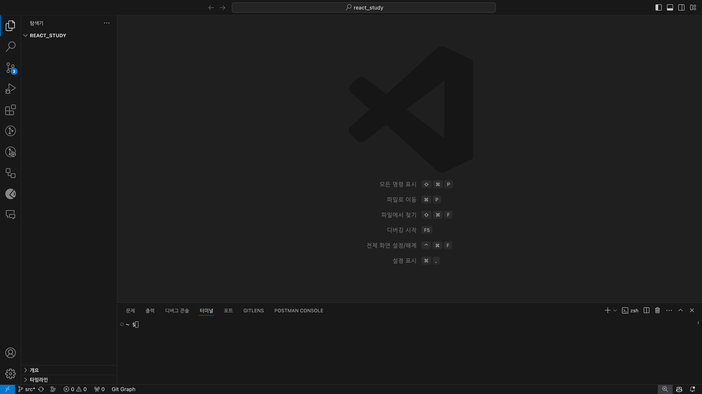
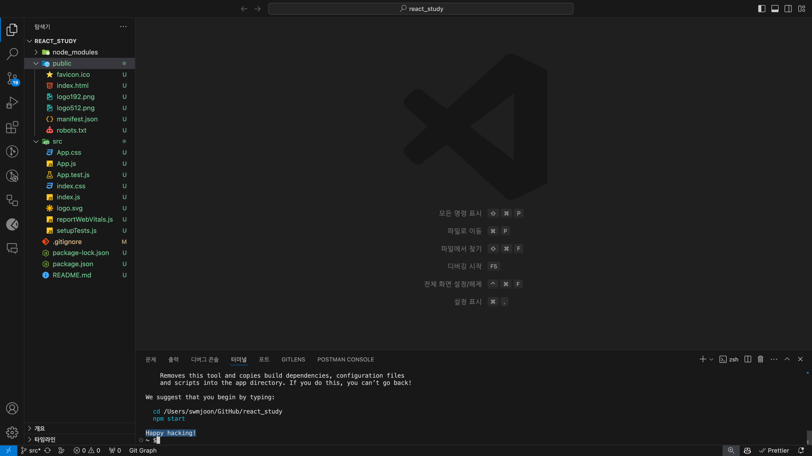
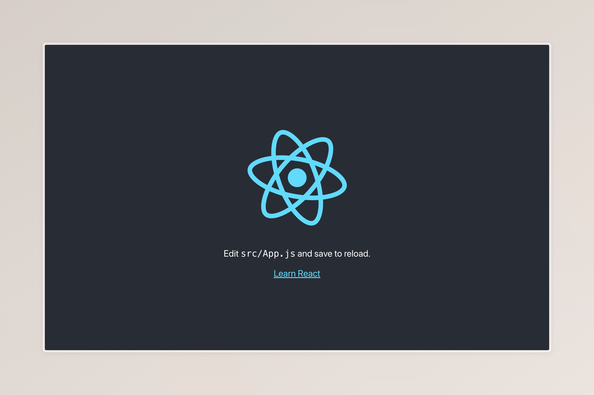
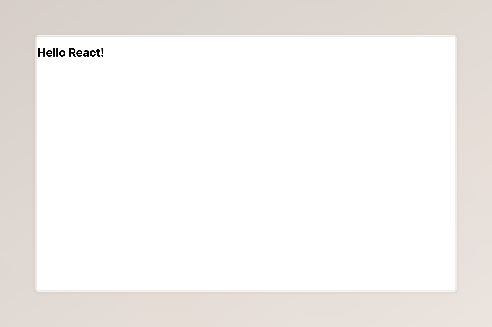

# Chapter 1. React와 첫인사

## Node.js

원래 JavaScript는 웹브라우저(예: 크롬, 사파리, 엣지)에서 동작합니다. 사용자가 서버에 접속하면 서버가 JavaScript 파일을 응답해 주고, 웹브라우저가 컴파일 비스름한 작업을 함으로써 이를 실행하는 것이죠. 중요한 점은 **원래 JavaScript는 브라우저 내에서 실행**된다는 것입니다. 이러한 특징 덕분에 JavaScript는 사용자 컴퓨터의 시스템에 접근하거나 파일을 조회할 수 없죠. 즉, JavaScript는 브라우저 내에 격리됨으로써 악성 웹으로부터 사용자의 컴퓨터를 보호합니다.

어느 날 C나 Java 같은 언어처럼 JavaScript를 웹브라우저가 아닌 컴퓨터에서 동작하게 해보자는 의견이 생겼고, 2009년에 Node.js라는 런타임 환경이 등장합니다. 이 Node.js라는 런타임 환경을 설치하면, 브라우저 밖에서, 즉 사용자의 컴퓨터에서 JavaScript를 실행할 수 있게 됩니다.

React 수업에서 뜬금없이 Node.js를 설명하는 데 의문을 가질 수도 있겠다만, 이는 React가 Node.js를 기반으로 동작하기 때문입니다. 이러한 이유로 우리는 Node.js를 설치한 후 그 위에서 React를 다뤄보도록 할 것입니다.

## React 설치하기

> 실습 시점에 따라 이곳에 적힌 내용과 조금씩 다를 수 있습니다.

백문이 불여일견. 직접 실습해 보면서 차근차근 React와 친해져 봅시다. 앞서 React는 Node.js를 기반으로 동작한다고 했습니다. 따라서 우리는 Node.js를 설치한 후에 React를 설치할 것입니다.

구글에 Node.js를 검색하여 [Node.js 공식 홈페이지](https://nodejs.org)에 접속합니다. 대문짝만하게 적혀있는 'Download Node.js (LTS)' 버튼을 눌러 설치 파일을 다운받습니다. 다운받은 설치 파일을 열어 Node.js 설치를 진행합니다.

이제 Node.js가 정상적으로 설치되었는지 확인해 봅시다. 터미널(윈도우에서는 `cmd`라고 합니다)을 열어 `node -v`를 입력합니다. `v20.12.1`과 같은 응답이 나오면 정상적으로 Node.js가 설치된 것입니다. 여기서, 20.12.1은 설치된 Node.js의 버전을 의미합니다. Node.js를 설치할 경우 기본적으로 React도 함께 설치되기에 추가로 이를 설치할 필요는 없습니다.

> **`node -v` 명령어를 입력하면 오류가 떠요**  
> Node.js가 시스템의 환경변수에 적용되지 않아서 생긴 문제입니다. 대부분의 경우 컴퓨터를 재시작하면 해결됩니다.

바탕화면 같은 곳에 우리가 실습할 새로운 폴더를 하나 만들어봅시다. 대문자나 특수문자가 포함될 경우 오류가 발생할 수 있으니 유의하여야 합니다. 여기서는 평범하게 `react_study`라고 이름 짓겠습니다.

이제, Visual Studio Code를 엽니다. 상단바 '파일(File)'에서 '폴더 열기(Open Folder)'를 클릭한 후 방금 우리가 만든 폴더를 선택하여 열어줍니다. 이후, 다시 상단바 '터미널(Terminal)'에서 '새 터미널(New Terminal)'을 클릭해 터미널을 열어줍니다. 아래 스크린샷과 같은 화면이 되어야 합니다.(확장 프로그램 등 환경 설정에 따라 조금씩 다를 수 있음)

화면 아래 생긴 터미널은 아까 우리가 `node -v`로 Node.js 설치를 확인할 때 사용했던 터미널(윈도우에서는 `cmd`)과 같은 것입니다. 여기에 `node -v`를 입력해도 아까와 같은 답이 돌아옵니다.

이제 이 폴더에 React를 설치해 봅니다. 터미널에 `npx create-react-app .`을 입력합니다. 마지막 `.`은 프로젝트를 생성할 위치를 의미하는 것으로, 우리는 현재 디렉토리에 만들 것이기에 현재 디렉토리를 의미하는 `.`을 적은 것입니다. 만약 'code'라는 하위 폴더에 만들고 싶다면 `npx create-react-app ./code`와 같이 입력하면 됩니다.

> **`Unknown command: "create-react-app"` 오류가 떠요**  
> React가 설치되지 않아서 생긴 오류예요. 대부분의 경우 Node.js를 설치할 때 함께 설치되지만 그렇지 않은 경우도 있어요. 이때는 수동으로 React를 설치해서 해결할 수 있어요. 터미널에 `sudo npm install -g react`라고 입력하여 React를 설치해 주세요. 시스템 비밀번호의 입력이나 동의가 요구될 수 있어요.

> **`The directory . contains files that could conflict` 오류가 떠요**  
> React를 설치할 폴더에 다른 파일이 존재하는 경우에 발생하는 오류예요. 충돌을 방지하기 위해 React 설치 전 프로젝터 폴더는 깔끔하게 비워주세요.

React가 프로젝트 폴더에 설치되는 동안 터미널에는 무언가가 진행되는 듯한 모습이 보이고 디렉토리에 다양한 폴더와 파일이 생성되는 것을 볼 수 있습니다. 인터넷 환경과 실습 기기에 따라 시간이 소요될 수 있으며, 설치가 완료되면 터미널에 `Happy hacking!`이라는 문구가 나타날 것입니다.


## 첫 React 웹페이지 마주하기

React 설치도 끝냈으니, 우리의 첫 React 웹페이지를 만나봅시다. React 설치 과정에서 기본 웹페이지도 세팅되기 때문에 바로 만나볼 수 있어요. 터미널에서 `npm start`를 입력합니다. 권한 동의가 요구될 경우 동의해 주세요. 터미널에 'successfully' 글자가 나오며 자동으로 브라우저가 나타날 것입니다. 아래와 같이 웹페이지가 나타나면 성공입니다.


권한 동의에 거부하거나 실습 기기의 시스템 설정의 이유로 자동으로 브라우저가 나오지 않는 경우도 있습니다. 이때는 직접 브라우저를 켜면 되는데, 터미널에 적혀 있는 `http://localhost:3000` 따위의 주소로 접속하면 됩니다. `:` 다음에 나오는 3000과 같은 숫자를 '포트(Port)'라고 하는데, 3000번 포트가 다른 프로그램에 의해 사용 중인 경우 다른 포트를 사용하게 될 수도 있습니다. 참고로 키보드의 'Ctrl+C'를 눌러 실행한 서버를 중단할 수 있습니다.

`npm start`로 React를 실행하게 되면, 터미널에는 실행된 React 정보가 실시간으로 작성됩니다. 앞으로 개발하다가 발생하는 경고와 에러도 이곳 터미널에 실시간으로 반영되어 나타날 예정입니다. `local`과 `On Your Nextwork`에 적힌 두 주소 모두 들어갈 수 있으며, 같은 네트워크에 속해 있는 다른 기기에서도 `On Your Nextwork`에 적힌 주소를 통해 접속할 수 있습니다.

여러분은 생애 첫 React 웹페이지를 만드는 데 성공하였습니다. 축하합니다.

[소스코드 변경 사항](https://github.com/mjun0328-study/Course_React/commit/93afd37388c27e1b84fced207cf3274a639be448)

## 실습할 준비하기

실습을 준비함에 앞서, 한 가지 신기한 사실을 알려주도록 하겠습니다. `npm start`를 통해 React를 실행한 후 접속하였다면, 이후에 React 코드를 수정한 후 저장하기만 해도 실시간으로 웹페이지에 수정된 코드가 반영됩니다. 다시 말해서, 저장만 해도 자동으로 반영되기 때문에 React를 개발하다가 웹페이지를 새로고침하거나 다시 열 필요가 없다는 말이죠. 다만, 가끔 코드 수정 후 새로고침해야 할 상황이 생기기도 합니다. 코드를 수정하였음에도 반영되지 않거나 정상적으로 작동되지 않는다고 생각된다면 새로고침해보는 것도 좋은 방법 중 하나라 생각됩니다.

이제 본격적인 실습에 앞서 복잡하거나 불필요한 코드들을 정리해 보도록 하겠습니다. 여기서 삭제하거나 수정하는 부분들은 예제 화면을 위해 존재했던 것이거나 전문적인 개발을 위해 사용되는 것들로, 실습하는 단계에서는 사용하지 않기에 핵심적인 부분을 제외하고는 모조리 다 날려버릴 것입니다.

먼저, `src` 폴더 안에 있는 아래 파일들을 삭제합니다.

- `App.css`
- `App.test.js`
- `logo.svg`
- `reportWebVitals.js`
- `setupTests.js`

그다음 `App.js` 파일의 코드들을 대거 삭제하여 아래와 같이 만들어줍니다.

```JavaScript
function App() {
  return <div></div>;
}

export default App;
```

마지막으로, `index.js` 파일에서도 코드들을 삭제하여 아래와 같이 만들어줍니다.

```JavaScript
import React from "react";
import ReactDOM from "react-dom/client";
import "./index.css";
import App from "./App";

const root = ReactDOM.createRoot(document.getElementById("root"));
root.render(<App />);
```

이제 다시 웹페이지로 돌아가 보면 아무것도 없는 빈 화면만이 있을 것입니다. 그 비밀은 `App.js`의 `App` 함수에 있는데, 이 함수는 `<div></div>`만을 반환(return)하기 때문입니다. 반환되는 값을 `<h1>Hello, React!</h1>`라고 바꾼다면 아래처럼 화면에 "Hello, React!"라는 문구가 나타날 것입니다.


[소스코드 변경 사항](https://github.com/mjun0328-study/Course_React/commit/202d9f6e9a23a21ed8796917bc0f8fa89d0f2268)

## 폴더 구조 알아보기

우리가 `npx create-react-app .` 명령어를 써서 React 개발 환경을 설치하면 수많은 파일과 폴더가 자동으로 생성됩니다. 여기서는 각 파일과 폴더가 어떤 역할을 하는지 간단히 살펴봅니다.

먼저 `package.json`와 `package.lock.json` 파일입니다. 앞으론 이 두 파일을 '패키지 파일'이라고 하겠습니다. 이 패키지 파일들에는 우리가 만든 프로젝트에 관한 정보가 담겨 있습니다. Node.js 생태계에서는 다른 개발자들이 만들어 배포한 오픈소스를 우리 프로젝트에서 쉽고 자유롭게 설치해 사용할 수 있습니다. 그리고 우리 프로젝트에서 사용한 오픈소스들의 목록도 이 패키지 파일에 적히는 것이죠. 어려울 수 있습니다. 당연해요. 아직 제대로 된 실습조차 해보지 않은 상태에서 이론적인 부분부터 다가가니 감이 안 잡힐 것입니다. 그냥 '아, 이런 게 있구나' 정도로만 이해하고 넘어가도 아무런 문제가 없습니다. 적어도 이 부분에서는 전부를 이해하려고 끙끙대는 것을 추천하지 않습니다.

`node_modules` 폴더를 열어보면 수많은 폴더가 담겨 있는 것을 볼 수 있습니다. 이 폴더에는 앞서 말한 오픈소스의 코드들이 저장됩니다. React 하나만 설치했는데도 얼마나 많은 오픈소스가 다운로드 됐는지 감이 오시나요? 우리 프로젝트에서 사용되는 오픈소스의 목록이 패키지 파일에 기록되는 것이고, 그 오픈소스 코드들이 `node_modules` 폴더에 저장된다고 이해할 수 있겠습니다. 그래서 React를 개발하다가 개발 파일을 다른 사람에게 전달하거나 GitHub 같은 곳에 저장할 때는 `node_modules` 폴더를 빼고 저장해도 됩니다. 어차피 오픈소스 목록은 패키지 파일에 저장되기 때문이죠. 전달받은 사람은 터미널에 `npm install` 명령어를 입력하여 패키지 파일에 기재된 오픈소스를 완전히 똑같이 설치할 수 있습니다. 터미널에서 키보드의 Ctrl+C를 눌러 서버를 종료한 후 한 번 `node_modules` 폴더를 삭제해 봅시다. 이후 터미널에서 `npm install`을 입력하면 무언가를 다운받으며 폴더가 다시 가득 채워질 것입니다.

우리가 아까 코드를 삭제하고 편집했던 `src` 폴더에는 React 개발 코드들이 담깁니다. 우리는 이 폴더 내에서 코드를 만들고, 지우고, 수정하며 React 웹페이지를 개발하게 됩니다. 앞으로의 개발 과정은 사실상 전부 이 폴더 안에서 이루어진다고 볼 수 있습니다.

`public` 폴더입니다. 열어보면 `logo512.png`을 비롯한 몇 가지 파일이 담겨 있습니다. 이 폴더는 외부에서 직접 접속할 수 있습니다. `http://localhost:3000/logo512.png`에 접속해 보면 (포트 번호는 사용자 환경에 따라 다를 수 있습니다. 터미널에 나와 있는 주소를 참고하세요.), `logo512.png` 이미지가 나타날 것입니다. 이렇듯
`public` 폴더에는 정적인(HTML, 이미지, robots.txt 등) 파일이 담깁니다. 다소 추상적인 개념이라 이해하기 난해할 수 있습니다. 여기도 마찬가지로 '아, 이런 게 있구나' 정도만 이해하고 넘어가면 됩니다.

이제 마지막 하나의 폴더만이 남았습니다. 폴더가 더 없다고요? 정상입니다. 이제 만들 것이기 때문이죠. 우리가 React로 웹페이지를 개발한 후에는 이를 배포해야 합니다. 하지만 이 수많은 파일을 전부 서버에 올리는 건 좋지 않습니다. 용량이 크기도 하고 비효율적이기 때문이죠. React에서는 배포용 폴더를 따로 만들어 용량을 획기적으로 줄일 수 있습니다. 터미널에서 `npm run build`를 입력합니다. 무언가 처리되는 듯한 과정이 지나면 `build` 폴더가 생긴 것을 볼 수 있습니다. `public` 폴더에 있던 파일들도 있고, `static` 폴더를 열어보면 JavaScript와 CSS는 각각 오직 하나(2개에서 3개의 파일이 있을 수 있는데, 소스맵이라 하는 보조 파일이거나 라이센스 파일일 것입니다. 실제 동작하지는 않는 보조적인 파일입니다.)의 파일로 합쳐져 있습니다. 우리는 이 폴더만을 서버에 올림으로써 우리가 만든 웹페이지를 배포할 수 있습니다. `public` 폴더는 소스 코드를 변경하였다 해서 자동으로 바뀌지 않습니다. 반드시 `npm run build`를 하여야 생성됩니다.

지금까지 우리는 React의 이론적 개념을 대략적으로나마 이해하고 실습할 준비를 마쳤습니다. 다음 시간부터는 React를 직접 다뤄보며 몸에 익혀 가보도록 하겠습니다. 수고하셨습니다.
