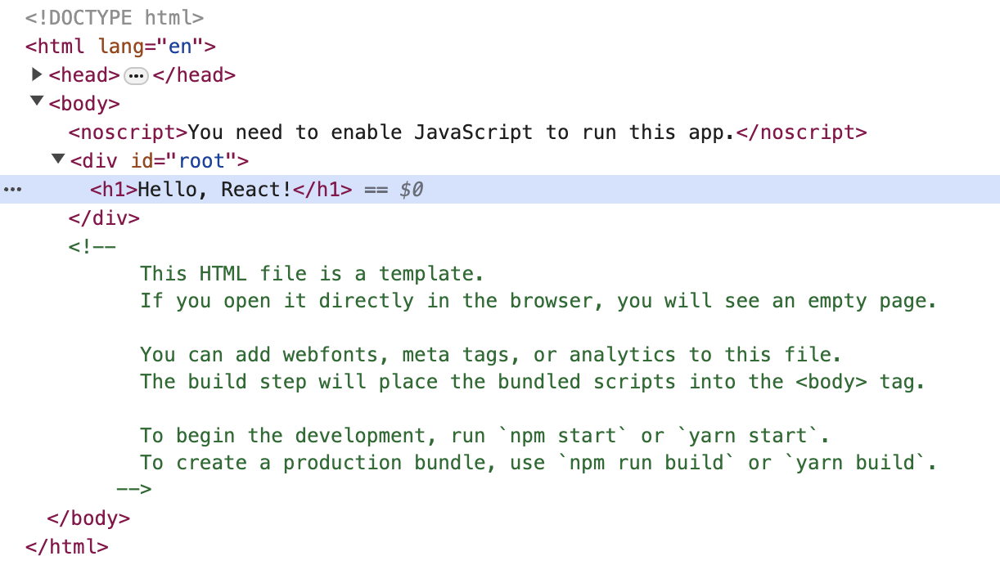
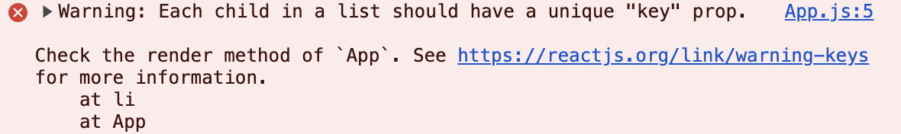

# Chapter 2. 목차의 구현과 리액트 음미

## 들어가기

이제부터 본격적으로 우리의 React 웹페이지를 구축해 가는 여정을 시작해 봅시다. `App.js` 파일을 살펴보면 `App` 함수가 지난 시간에 했듯 `<h1>Hello, React</h1>` 코드를 반환하고 있을 것입니다. 그리고 `npm start`로 React 서버를 실행한 후 웹페이지에서 개발자 모드를 켜 HTML 코드를 확인해 보면 아래 사진과 같이 'root'라는 ID를 가진 `<div>`가 `App` 함수가 반환하는 요소를 자식으로 가지고 있음을 알 수 있습니다.


이를 통해 우리는 `App` 함수가 반환하는 요소가 곧 React 웹페이지에서 나타나는 요소임을 알 수 있습니다. 지금부터 우리는 이 `App` 함수를 요리조리 다뤄보면서 웹페이지의 기능을 하나씩 구축해 나갈 것입니다.

## 목차 만들기

목차를 만들기 위해 `App` 함수를 아래와 같이 수정해 봅시다. 함수 아래에 있는 `export default App;` 부분은 건들지 않습니다.

```JavaScript
function App() {
  return (
    <div>
      <h1>Hello, WEB!</h1>
      <ol>
        <li>HTML</li>
        <li>CSS</li>
        <li>JavaScript</li>
        <li>React</li>
      </ol>
    </div>
  );
}
```

아래와 같은 화면이 구축될 것입니다.


이제부터 우리는 목차가 추가될 때마다 `<li>어쩌고저쩌고</li>`를 추가하고, 삭제할 때마다 그 태그를 제거해버리면 될 것입니다. 그런데, 만약 이 목차가 100개가 넘는다고 생각해 봅시다. 정상적으로 작동은 될 거예요, 컴퓨터는 똑똑하니까 말이죠. 하지만 목차의 `<li>` 태그를 전부 `<a>` 태그로 바꿔야 한다고 생각해 봅시다. 100개가 넘는 태그를 하나씩 수정하며 우린 눈물을 흘려야 할 거예요. 상상만 해도 끔찍하죠? 이런 사태를 방지하기 위해 우리는 바로 아래에 설명될 map 함수를 이용해 목차를 자동화해 보겠습니다.

## map 함수의 등장

map 함수는 배열의 원소들을 순차적으로 가져와 처리한 후 처리된 원소들로 새로운 배열을 만들어 반환해 줍니다. 정의로 설명하니 추상적이기도 해서 더 어렵게 느껴질 수도 있습니다. 아래의 예제 코드를 확인해 봅시다.

```JavaScript
const color = ["red", "blue", "green"];
const loveColor = color.map((x, i) => {
  console.log(i, x);
  return "I love " + x + "!";
});
console.log(loveColor);

// Expected output
// 0 'red'
// 1 'blue'
// 2 'green'
// Array ['I love red!', 'I love blue!', 'I love green!']
```

위 예제 코드에서 map 함수는 `color` 배열의 요소를 하나씩 가져와 `x` 변수에 담고, `"I love " + x + "!"`를 반환합니다. 그리고 반환된 세 요소를 가진 새로운 배열을 만들어 `loveColor` 배열에 저장합니다. 여기서 첫 번째 인자인 `x`는 값 자체를, 두 번째 인자인 `i`는 몇 번째 요소인지를(0부터 시작) 갖고 있습니다. 자세한 명세는 [여기](https://developer.mozilla.org/ko/docs/Web/JavaScript/Reference/Global_Objects/Array/map)를 참고할 수 있습니다.

이제 이 map 함수를 목차 코드에 적용해 봅시다. 태그 안에 JavaScript 코드를 삽입할 때는 `{`와 `}`로 코드를 감싸야 합니다. 아래처럼 말이죠.

```JavaScript
function App() {
  const index = ["HTML", "CSS", "JavaScript", "React"];
  return (
    <div>
      <h1>Hello, WEB!</h1>
      <ol>
        {
          index.map((x) => {
            return <li>{x}</li>
          })
        }
      </ol>
    </div>
  );
}
```

위 코드에서 map 함수는 index라는 배열을 순차적으로 돌면서 `<li>배열의 값</li>`을 뿜어낼 것입니다. 이제 우리는 목차를 추가하거나 수정하거나 삭제할 필요가 있다면, 이 index 배열만 수정하면 되는 것이죠. 이제 우리는 목차가 100개가 넘고 `<li>`를 `<a>` 태그로 수정해야 하더라도 더 이상 눈물을 흘리지 않아도 됩니다. `return <li>{x}</li>` 부분을 `return <a>{x}</a>`로 바꾸기만 하면 되니까요. 100개가 넘는 목차를 5초도 되지 않아 일괄적으로 수정할 수 있는 것입니다.

## map 함수와 key

여기까지 모든 게 완벽해 보이지만 한 가지 빠진 점이 있습니다. 개발자 모드를 열어 console 탭에 들어가면 아래와 같은 경고가 있을 것입니다.


이 오류는 map 함수로 생성된 요소들이 key 값을 가지고 있지 않아 생기는 오류입니다. React는 map 함수로 요소들을 생성할 경우, 안정적인 렌더링을 위해 각 요소들을 식별하기 위한 값을 key라는 속성으로 전달할 것을 요구합니다. 이때 key 값은 식별을 위한 것이기에 중복되지 않은 고유한 값이어야 합니다.

이제 오류를 해결해 봅시다. 우리는 식별을 위한 값으로 '몇 번째 목차인지'를 전달해 주도록 하겠습니다. map 함수의 두 번째 인자를 활용해서 말이죠. 앞서 작성한 코드의 일부를 아래와 같이 수정해 봅니다.

```JavaScript
index.map((x, i) => {
  return <li key={i}>{x}</li>
})
```

이제 새로고침을 해도 더 이상 오류가 발생하지 않습니다.

[소스코드 변경 사항](https://github.com/mjun0328-study/Course_React/commit/f3012fa1a6fc491bcca11967e95cfb2fe38aefc8)

## 음미하기

우리는 방금 몇 시간이 걸릴 비효율적인 노동을 쉽고 빠르고 간편하고 똑똑하게 자동화하였습니다. 그것도 매우 간단한 코드를 통해서 말이죠. 우린 여기서 "아, 이런 기능이 있구나"로 끝내서는 안 됩니다. 이런 자동화가 우리의 웹 개발에 있어 폭발적인 능력을 이끌어내게 해준다는 점을 음미할 필요가 있습니다. 실제 대부분의 웹 사이트들은 방금 우리의 목차처럼 같은 작업을 반복하고, 같은 기능을 여러 곳에서 사용하기도 합니다. 이럴 때 React의 이런 특징은 비효율적인 작업에서 우리를 벗어나게 해줍니다.

물론 React의 수많은 기능 중에서 우린 아직 발톱 정도밖에 다루지 않았습니다. 하지만 겁먹지는 마세요. 그 기능 중 5%만 알아도 여러분이 생각하는 웹페이지를 만들어 낼 수 있습니다. 나머지 95%는 그 만드는 과정을 더욱 손쉽게 해주는 역할에 불과하거든요. 우리는 그런 기능들을 하나씩 알아가면서 극강의 효율적인 개발의 세계에 빠져볼 겁니다.

무언가를 배울 때는 "왜 배우는지"를 알아야 합니다. 더하기가 반복되는 식을 수월하게 계산하고 표현하기 위한 것이라는 것을 알고 곱하기를 배우는 것과 이유도 모른 채 무작정 곱셈 개념을 머릿속에 집어넣는 것은 학습 과정에서 매우 큰 차이를 갖습니다. 우리는 "HTML과 JavaScript로도 만들 수 있는데 왜 React를 공부해야 하는 건가요?"라고 의문을 품어야 합니다. React 없이 HTML과 JavaScript로도 충분히 우리가 만들고자 하는 웹페이지는 만들 수 있습니다. React를 사용해야만 만들 수 있는 웹페이지라는 것은 없다는 것이죠. 우리는 이미 React를 배우는 이유를 알아보았습니다. 우리의 비효율적인 노동을 쉽고 빠르고 간편하고 똑똑하게 자동화할 수 있기 때문이죠. 우리는 수많은 목차를 map 함수를 이용하여 자동화하였습니다. 이제 우리는 코드 한 줄만 바꾸면 수십, 수백 개에 달하는 목차도 단숨에 수정할 수 있게 되었습니다.

이제부터 React가 어떻게 우리의 노고를 덜어줄 수 있는지에 대해 맛보기로 다뤄보겠습니다. 이제부터 나올 내용들은 맛보기 위한 것이기에 전혀 외울 필요도, 이해할 필요도 없습니다. 'React를 이런 방식으로 우리가 쉽고 효율적으로 개발할 수 있게 해주는구나' 정도만 이해하도록 합니다.

본문이나 여러 기능을 넣는다 가정하고 `App.js`의 코드를 아래와 같이 작성하고, 저 `<p>Hello, React<p>`가 수백 개 있다고 생각해 봅니다.

```JavaScript
function App() {
  const index = ["HTML", "CSS", "JavaScript", "React"];
  return (
    <div>
      <h1>Hello, WEB!</h1>
      <ol>
        {index.map((x, i) => {
          return <li key={i}>{x}</li>;
        })}
      </ol>
      <p>Hello, React</p>
      <p>Hello, React</p>
      <p>Hello, React</p>
      <p>Hello, React</p>
      <p>Hello, React</p>
      <p>Hello, React</p>
      <p>Hello, React</p>
      <p>Hello, React</p>
      <p>Hello, React</p>
      <p>Hello, React</p>
      <p>Hello, React</p>
      <p>Hello, React</p>
      <p>Hello, React</p>
      <p>Hello, React</p>
      <p>Hello, React</p>
      <p>Hello, React</p>
    </div>
  );
}

export default App;
```


그런데 개발 도중 기능에 변경을 가할 필요가 있어 저 Hello, React를 모조리 Bye, React로 바꿔야 하는 일이 생겼습니다. 수백 개에 달하는 Hello를 하나씩 Bye로 바꾸는 것은 상상만 해도 끔찍할 것입니다. 우리는 이 `<p>Hello, React</p>`를 Hello라는 이름의 함수를 만들어 담아보겠습니다. 아래처럼 말이죠.

```JavaScript
function Hello() {
  return <p>Hello, React</p>;
}
```

그리고 기존에 썼던 `<p>Hello, React</p>` 코드들을 모조리 `<Hello />`로 바꿔줍니다.
전체 코드는 아래와 같습니다.

```JavaScript
function App() {
  const index = ["HTML", "CSS", "JavaScript", "React"];
  return (
    <div>
      <h1>Hello, WEB!</h1>
      <ol>
        {index.map((x, i) => {
          return <li key={i}>{x}</li>;
        })}
      </ol>
      <Hello />
      <Hello />
      <Hello />
      <Hello />
      <Hello />
      <Hello />
      <Hello />
      <Hello />
      <Hello />
      <Hello />
      <Hello />
      <Hello />
      <Hello />
      <Hello />
      <Hello />
      <Hello />
    </div>
  );
}

function Hello() {
  return <p>Hello, React</p>;
}

export default App;
```

> **원래 함수가 `<p>` 같은 HTML 태그를 반환(return)할 수 있나요?**  
> 아니요! JavaScript에는 HTML 태그를 반환하는 것은 물론 변수에 저장하는 것도 불가능합니다. 여기에는 JSX(Javascript Syntax eXtension)라고 불리는 JavaScript를 확장한 문법이 사용되는데, 우리가 처음에 `npx create-react-app .` 명령어를 통해 React 환경을 구축할 때 이 JSX도 함께 설치되기 때문에 별도의 작업 없이 HTML 태그를 자유자재로 다룰 수 있게 됩니다.

Hello라는 이름의 함수는 `<p>Hello, React</p>`를 반환합니다. 우리가 이 함수를 HTML 태그로 추가하고 싶다면, 즉 이 Hello 함수를 호출하여 HTML 태그로 넣고 싶다면, `Hello()` 대신 `<Hello />` 또는 `<Hello></Hello>`를 적으면 됩니다. 다시 말해서, 저 `<Hello />` 코드들은 기능적으로 보았을 때 `Hello()`와 같습니다.

이제 다시 `Hello, React`를 전부 `Bye, React`로 바꿔야 할 일이 생겼다고 생각해 봅니다. 수백 개에 달하는 Hello를 Bye로 바꾸는 기존의 방식과 달리 이제는 저 `Hello` 함수만 수정해 주면 됩니다. 아래처럼 말이죠.

```JavaScript
function Hello() {
  return <p>Bye, React</p>;
}
```

단 한 줄의 코드만을 변경하여 우리는 수백 개의 요소들을 수정할 수 있게 되었습니다.


마지막으로 하나만 더 해보고 이번 수업을 마무리해 보겠습니다. `Bye, `는 동일하지만, 그 뒤에 나오는 React를 각각 변경하고 싶으면 어떻게 할까요? 하나는 `Bye, React`지만 다른 하나는 `Bye, JavaScript`, 또 다른 하나는 `Bye, HTML`처럼 말이죠. 저 `Hello` 함수를 약간 수정하여 이와 같은 기능이 작동하도록 해보겠습니다. 다시 한번 강조하지만, 여기에 나오는 코드들은 외울 필요도, 이해할 필요도 없습니다. React가 어떤 방식으로 우리를 편하게 해주는지를 설명하기 위한 맛보기 과정에 있기에 일부러 코드들에 관한 설명도 하지 않을 예정입니다.

`App` 함수의 `<Hello />` 부분과 `Hello` 함수를 아래와 같이 수정합니다.

```JavaScript
function App() {
  const index = ["HTML", "CSS", "JavaScript", "React"];
  return (
    <div>
      <h1>Hello, WEB!</h1>
      <ol>
        {index.map((x, i) => {
          return <li key={i}>{x}</li>;
        })}
      </ol>
      <Hello name="React" />
      <Hello name="JavaScript" />
      <Hello name="HTML" />
      <Hello name="Node.js" />
      <Hello name="WEB" />
      <Hello name="HTTP" />
    </div>
  );
}

function Hello({ name }) {
  return <p>Bye, {name}</p>;
}

export default App;
```


React로 인해 얻을 편리함이 느껴지시나요? 이제 우리는 저 `Hello` 함수를 통해 수백 개에 달하는 HTML 태그들을 마음껏 수정할 수 있게 되었습니다. 여기서 그치지 마시고 직접 코드들을 수정하여 느껴보도록 합니다. 이제 비로소 여러분은 왜 React를 배워야 하는지 알게 되었습니다. 축하합니다.

[소스코드 변경 사항](https://github.com/mjun0328-study/Course_React/commit/d368fe69260dae911847de15dcd2231a47e88bca)
