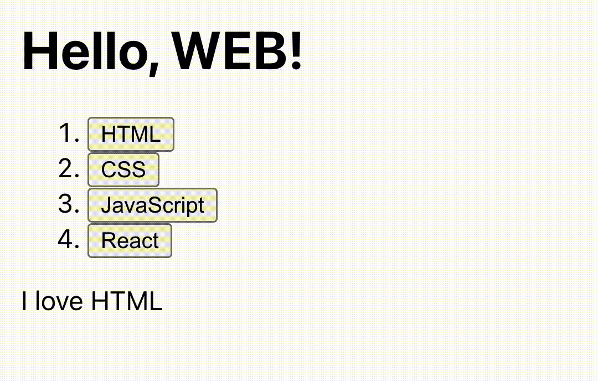
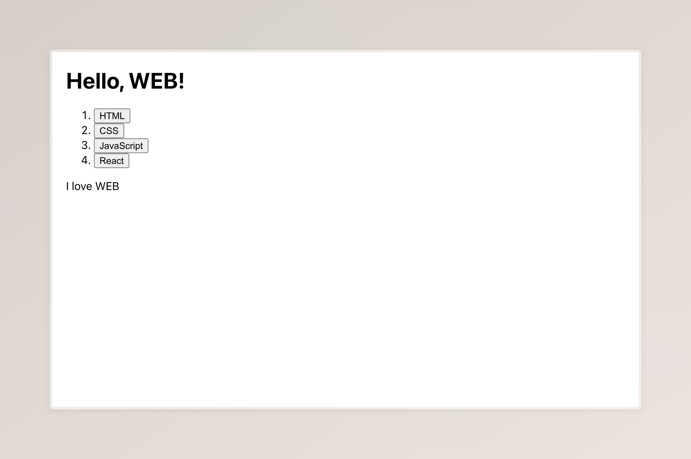
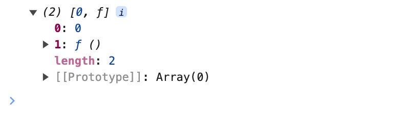
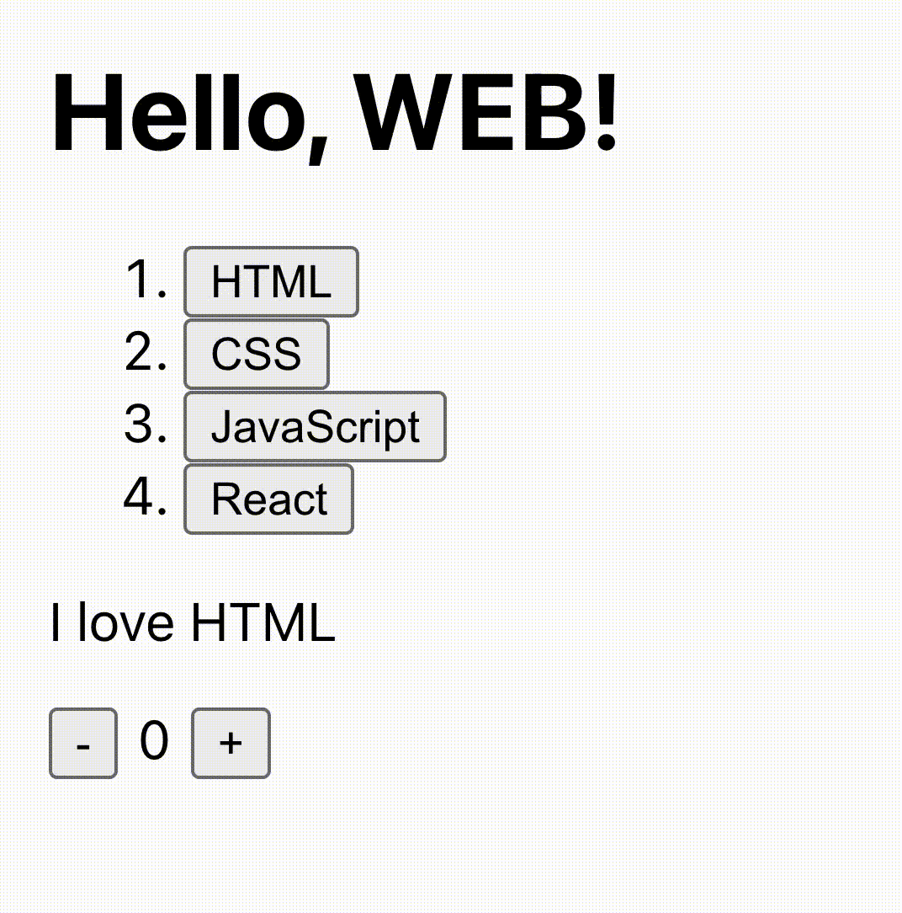
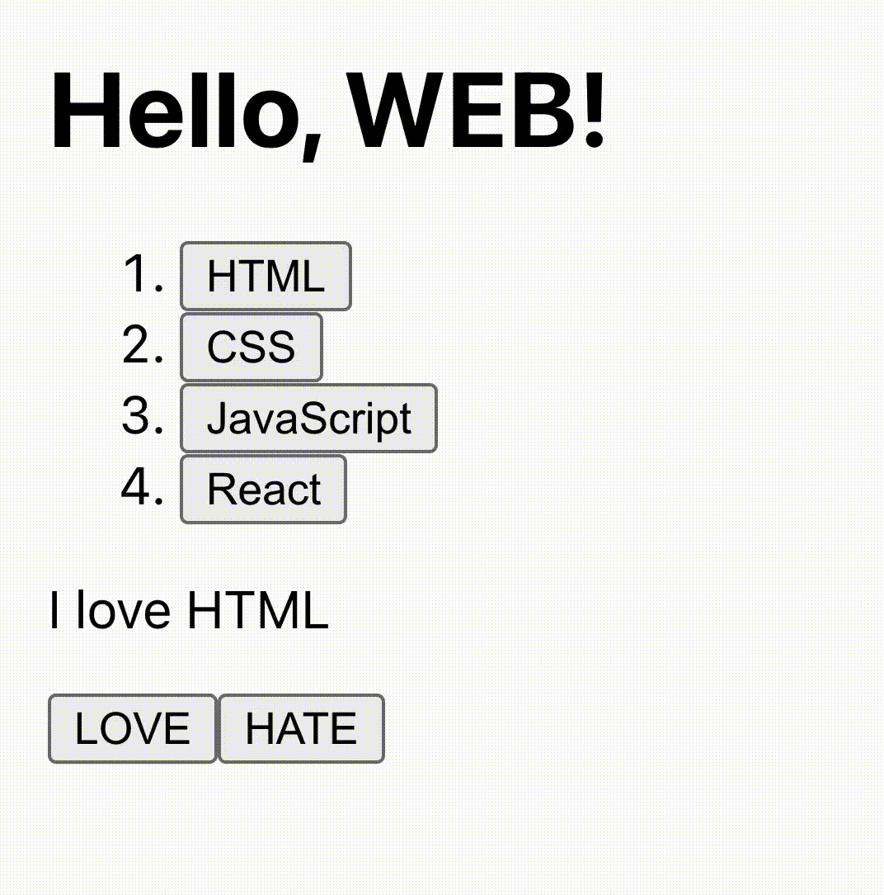

# Chapter 3. useState로 본문 구현

## 형태 갖추기

목차까지 만들었으니 이제는 목차를 선택할 때마다 목차에 해당하는 글을 보여주는 기능을 추가해 보겠습니다. 아래 GIF처럼 말이죠.


우선 이전 시간 맛보기 때 했던 `Hello` 함수와 `<Hello />` 코드들은 다시 지워줍니다. 그 후 목차에 `<button>` 태그를 삽입하여 클릭할 수 있도록 해주겠습니다. 아래와 같이 수정해 줍니다.

```JavaScript
index.map((x, i) => {
  return <li key={i}><button>{x}</button></li>
})
```

반환되는 태그의 길이가 너무 길어진다면 아래와 같이 `(`와 `)`로 태그 전체를 감싼 후 여러 줄에 걸쳐 적어줄 수 있습니다. 태그 전체를 괄호로 감싸야 한다는 점 기억하세요!

```JavaScript
index.map((x, i) => {
  return (
    <li key={i}>
      <button>{x}</button>
    </li>
  );
})
```

그리고 `<ol>`의 닫는 태그 아래에 `<p>` 태그도 추가해 줍니다.

```HTML
<p>I love WEB</p>
```

비록 작동은 되지 않지만, 목차는 버튼으로 바뀌고 본문 부분도 생겨 나름대로 우리가 오늘 만들고자 하는 형태를 아래 사진처럼 갖추게 되었습니다. 이제 JavaScript를 통해 목차를 누르면 본문이 바뀌는 기능만 추가해 주면 될 것 같습니다.



[소스코드 변경 사항](https://github.com/mjun0328-study/Course_React/commit/0731947e398e976eb8ae6051cd5ad3bfbbbfb3b8)

## 이벤트 핸들러

1차적으로, 목차를 누르면 본문이 "I love ~~~"로 바뀌도록 해보겠습니다. CSS 목차를 누르면 본문이 "I love CSS"가 되는 것처럼 말이죠.

일단 목차의 버튼을 클릭했을 때 무언가가 실행되도록 해야 합니다. 아직 본문을 수정하는 기능을 만들지 않았으므로, 일단은 버튼을 클릭했을 때 alert 함수로 "I am HTML"처럼 목차가 자신을 소개하도록 만들어 주겠습니다. 순수 HTML과 JavaScript에서는 클릭 이벤트를 `onclick` 속성을 통해 줄 수 있습니다. `onclick="foo"`와 같이 함수 자체를 문자열로 전달해 주어야 합니다. 상당히 불편하고 비효율적이라는 점을 어렵지 않게 느낄 것입니다. 함수를 다름 아닌 "문자열"로 전달해야 하기 때문이죠. 순수 HTML과 JavaScript에서는 아래와 같이 코드를 작성해야 했을 것입니다.

```JavaScript
<button onclick="alert('I am ' + x)">{x}</button>
```

하지만 우리의 React에서는 그런 수고를 하지 않아도 됩니다. 문자열이 아닌 JavaScript 코드로 전달해 줄 수 있기 때문이죠. 아래와 같이 말입니다.

```JavaScript
<button
  onClick={() => {
    alert("I am " + x);
  }}
>
  {x}
</button>
```

이제 버튼을 누르면 "I am CSS"와 같이 문구가 튀어나올 것입니다. 여기서 유의할 점은 React에서는 순수 HTML과 달리 `onclick`이 아닌 `onClick`으로 값을 전달해야 한다는 점입니다. 그리고 이는 `onKeyDown`과 `onFocus`를 비롯한 다른 이벤트 핸들러도 같습니다.

우리는 위 코드처럼 onClick 이벤트에 익명 함수를 전달하였지만, 아래 예제 코드처럼 따로 정의된 함수를 전달할 수도 있습니다.

```JavaScript
<button onClick={foo}>{x}</button>
```

이렇게 React를 이용하면 이벤트 핸들러를 직관적으로 지정하고 활용할 수 있습니다. 이벤트 핸들러의 함수가 수십 줄이어도 문제없죠.

[소스코드 변경 사항](https://github.com/mjun0328-study/Course_React/commit/80051d11a01e1945eef75db6197aa1f8c867b60e)

## 목차로 본문 변경하기 ~~(절망편)~~

목차를 누르면 본문이 바뀌도록 기능을 추가해 보겠습니다. 선택된 목차 번호를 담을 변수 `selected`를 하나 만들어 줍시다. 기능이 실행되는 절차를 대략 적어 보자면 아래와 같을 것입니다.

1. 목차에 있는 버튼을 누릅니다.
2. 버튼에 해당하는 목차 번호가 `selected`에 저장됩니다.
3. `<p>` 태그는 `I love {index[selected]}` 값을 갖습니다.

이 절차를 참고하여 코드를 작성해 봅시다.

`selected` 변수는 목차를 클릭할 때마다 바뀌므로 let으로 선언해 줍니다. 기본값은 `0`으로 하여 "I love HTML"이 나타나도록 하겠습니다.

```JavaScript
const index = ["HTML", "CSS", "JavaScript", "React"]; // 원래 있던 코드
let selected = 0;
```

목차의 `<button>` 태그는 클릭할 경우 `selected` 변수에 목차 번호가 저장되도록 해줍니다.

```JavaScript
<button
  onClick={() => {
    selected = i;
  }}
>
  {x}
</button>
```

마지막으로 본문의 `<p>` 태그도 아래와 같이 수정해 줍니다.

```JavaScript
<p>I love {index[selected]}</p>
```

이제 완성입니다. 이제 React는 우리의 완벽한 코드를 통해 목차를 누르면 본문의 내용이 바뀔 것입니다. 잘 작동되나요?

우리의 기대와 달리 아무리 버튼을 눌러도 본문은 꿈쩍도 하지 않을 것입니다. 변수의 값과 변화가 화면, 즉 UI에 반영되도록 하기 위해서는 React의 state라는 기능을 이용해야 합니다. 아래에서 마저 다뤄보도록 하겠습니다.

[소스코드 변경 사항](https://github.com/mjun0328-study/Course_React/commit/ab6101b3fbe23999e712c4847cca9325b3de0ebc)

## useState 알아보기

### useState 개념

useState라는 훅(Hook)을 이용하여 앞선 코드가 제대로 작동하도록 해보겠습니다. 다만 훅이 무엇인지에 관하여는 지금 다루지는 않을 것입니다.

useState는 상태(state)를 제어하게 해줍니다. 여기서 '상태'란 화면에 즉각 반영되는 변수라고 이해할 수 있습니다. 선택된 목차와 그 목차를 통한 본문의 변화가 즉각 화면에 반영되기 위해서는 선택된 목차라는 값이 앞선 `let selected = 0`과 같은 '변수'가 아닌 useState를 통한 '상태'로 저장되어야 합니다.

먼저, useState를 사용하기 위하여 `App.js`의 첫 번째 줄에 아래 코드를 적어줍니다. 말 그대로 React에서 useState를 가져오겠다는 뜻입니다. for나 if, map과 같은 JavaScript 기본 문법과 달리 useState는 React 함수이기에, 아래와 같이 React에서 useState를 가져오겠다고 선언해 주어야 하는 것입니다.

```JavaScript
import { useState } from "react";
```

그리고 기존 `let selected = 0` 부분을 아래와 같이 수정해 줍니다.

```JavaScript
const selected = useState(0);
console.log(selected);
```

이제 개발자 모드를 켠 후 console 탭에 들어가 `selected` 변수에 어떤 값이 들어있는지 확인해 봅시다. 아래 사진과 같이 `selected` 변수에는 첫 번째 요소가 0이고 두 번째 요소가 어떤 함수인 길이가 2인 배열이 저장됨을 확인할 수 있습니다. 이와 같이 useState는 길이가 2인 배열을 생성하는데, 첫 번째 요소에는 그 상태의 값이, 두 번째 요소에는 그 상태를 변경할 때 사용하는 함수가 담깁니다.


useState는 인자로 초깃값을 갖습니다. 즉, `const selected = useState(0);`이라는 코드가 있다면 이 `selected` 상태의 초깃값은 `0`임을 의미합니다. 이 초깃값의 자료형에는 제한이 없어서 숫자는 물론 문자열과 객체, 배열, null, undefined, 심지어는 함수도 가능합니다. 모든 유형의 값이 초깃값이 될 수 있죠.

```JavaScript
const _state1 = useState(0);
const state1 = _state1[0]; // 여기에는 상태의 값이 담기고
const setState1 = _state1[1]; // 여기에는 상태를 변경할 때 사용하는 함수가 담깁니다

const [state2, setState2] = useState(0); // 이렇게 구조 분해 할당을 이용해 한 번에 두 변수를 정의할 수도 있습니다.
```

> **작명 Tip**  
> 코딩에는 정답이 없지만, useState를 사용할 때 `const [state, setState] = useState(0)`처럼 `state`와 `setState`와 같이 이름을 짓는 게 관례예요. 상태 값 이름이 `count`라면 상태 값을 변경하는 함수의 이름은 `setCount`가 되겠죠.

useState의 두 번째 인자로 상태를 변경하는 방법은 간단합니다. 인자로 변경할 값을 전달하면 되는데, 예컨대 `setSelected(4);`는 상태를 `4`로 변경합니다. 이 또한 초깃값처럼 모든 유형의 값이 들어갈 수 있습니다. 특기할 점은 이 함수의 인자로 함수를 넣을 수 있다는 점입니다. 이 경우 반환되는 값이 상태 값이 됩니다. 아래와 같은 예제의 코드에서는 상태 값이 `Hello React!`와 같이 변경될 것입니다.

```JavaScript
const [state, setState] = useState(0);

setState(() => {
  const str1 = "Hello";
  const str2 = "React!";
  return str1 + " " + str2;
});
```

### Prev State 이용하기

버튼을 누를 때마다 숫자를 1씩 늘리는 웹페이지를 만든다면 useState를 어떻게 사용해야 할지 생각해 봅시다. 아래 코드처럼 `setCount`를 통해 상태 값을 `count+1`로 변경하도록 하면 될 것입니다.

```JavaScript
const [count, setCount] = useState(0);

const onClick = () => {
  setCount(count + 1)
}

return <button onClick={onClick}>Click me!</button>
```

잘 작동할 것입니다.(안 될 수도 있습니다) 그러나 `setCount(count + 1)`처럼 상태를 변경하는 함수 내에서 그 상태 값을 사용하는 것은 권장되지 않는 방법입니다.

숫자를 1씩 늘리는 예제처럼 현재 상태 값을 이용해 상태 값을 변경하는 방법을 알아봅니다. "현재 상태 값을 이용해 상태 값을 변경"하는 것이란 `setState(123)`이나 `setState(name)`과 달리 `setState(state + 1)`이나 `setState(!state)`처럼 새로운 상태 값이 현재 상태 값에 의존하게 되는 형태를 말합니다.

이 경우에는 함수 인자를 통해 상태 값을 변경해야 합니다. 앞서 설명할 때 말하지는 않았지만, 함수 인자를 통해 상태 값을 변경하게 되면 그 함수의 첫 번째 인자로 '현재 상태 값'이 전달됩니다. 아래 예제 코드에서는 이 값을 `prev`에 담아 `count + 1` 대신 `prev + 1`을 반환합니다.

```JavaScript
setCount(count + 1); // 비권장

setCount((prev) => { // 권장
  return prev + 1
});
```

그 이유를 설명하자면 이 글이 너무 길어지기에 이 정도까지만 하고 넘어가도록 하겠습니다. 내용이 다소 어려울 수 있습니다. 새롭고 추상적인 용어가 대거 등장하기도 했고 개념 자체가 애매하기 때문일 것입니다. 이 부분이 어렵다면 일단 넘어가도 좋습니다. 나중에 React에 대해 익숙해지고 나서 다시 돌아오는 것도 좋은 학습의 방법입니다.

## 목차로 본문 변경하기2 ~~(희망편)~~

앞서 배운 useState라는 강력한 도구로 다시 한번 목차 기능을 구현해 봅니다. 우선 React에서 useState를 쓰겠다는 의미로 첫 번째 줄에 아래와 같이 코드를 작성합니다.

```JavaScript
import { useState } from "react";
```

그다음, `let selected = 0;` 코드를 지우고 그 자리에 아래와 같이 작성합니다. `0`을 초깃값으로 하는 useState를 만들어 `selected`에는 상태의 값을, `setSelected`에는 그 상태를 변경할 때 사용하는 함수를 저장합니다.

```JavaScript
const [selected, setSelected] = useState(0);
```

이제 기존 `selected = i;`로 작성했던 onClick 핸들러를 수정해 주도록 합시다. `selected` 상태 값을 `i`로 변경하면 되기에 아래와 같이 수정하면 될 것입니다.

```JavaScript
<button
  onClick={() => {
    setSelected(i);
  }}
>
  {x}
</button>
```

`<p>I love {index[selected]}</p>` 부분은 이상 없으니 그대로 둡시다.

이제 완성입니다. 만들어진 웹페이지에서 목차를 누르면 본문이 자동으로 변경될 것입니다. 축하합니다.

[소스코드 변경 사항](https://github.com/mjun0328-study/Course_React/commit/e327e00e86f75d8add51799cf18725d361216d08)

## 📚 복습하기

'복습하기' 영역은 이번 챕터에서 배운 내용들을 되돌아보기 위해 준비된 코너입니다. 이 복습하기 영역에서 수정되는 코드는 다음 수업과 연계되지 않습니다.

### 복습1 - 카운터 구현하기

기존 `<p>I love {index[selected]}</p>` 코드 바로 아래 줄에 아래와 같이 코드를 추가로 작성해 줍니다.

```JavaScript
<div>
  <button>-</button>
  <span>0</span>
  <button>+</button>
</div>
```

우리는 숫자를 세주는 카운터를 만들고자 합니다. `-` 버튼과 숫자 표시기, `+` 버튼으로 구성된 카운터는 버튼을 누름에 따라 가운데 숫자 표시기의 수가 바뀝니다. 이 숫자 표시기의 기본값은 `0`이며, `-`를 누르면 작아지고 `+` 버튼을 누르면 커집니다. 방금 제시된 코드를 수정하여 아래 GIF와 같이 카운터 기능이 작동하도록 만들어 봅니다.

Tip: `count`와 `setCount`를 변수명으로 사용해 보도록 합니다.  
Tip: [스켈레톤 코드](https://github.com/mjun0328-study/Course_React/commit/14b7efef2a2e160e0d100106180217819d6252c0)를 참고해 보세요.



**여기서부터 정답 스포 주의**

[여기](https://github.com/mjun0328-study/Course_React/commit/116f22e8869a3156199f5388a6c8802aeb2b3498)를 눌러 정답을 확인할 수 있지만 코딩에 유일한 정답이란 없습니다. 정상적으로 동작한다면 정답인 것이겠죠? 여기서는 아래 예제와 같이 앞서 배운 Prev State를 이용하는 것이 핵심입니다.

```JavaScript
setState((prev) => {
  return prev * 2;
})
```

> **`return prev++`처럼 코드를 썼는데 잘 안 돼요**  
> `prev++`는 일명 후위연산자라고 하여 prev 값을 먼저 반환한 후 1을 더하는 연산자예요. 즉, `return prev++`이란 아래 코드와 의미가 같다는 것이죠. 예를 들어 prev가 `3`이라면 `return prev++`는 `3`을 반환한 후 prev를 `4`로 만들어요. `prev--`도 같은 원리로 동작해요.
>
> ```JavaScript
> return prev++;
> // same as
> return prev;
> prev = prev + 1;
> ```
>
> 한편, 전위연산자인 `++prev`는 1을 더한 후 prev 값을 반환하는 것으로 아래 코드와 같은 의미를 가져요. 즉, prev가 `3`이라면 `return ++prev`는 prev를 `4`로 만들고 `4`를 반환하는 것이죠. 마찬가지로 `--prev`도 같은 원리로 동작해요.
>
> ```JavaScript
> return ++prev;
> // same as
> prev = prev + 1;
> return prev;
> ```
>
> 따라서 `return prev++` 코드는 기존 `prev` 값을 반환하고 `prev`에 1을 더하는 것이기에 우리의 의도와 다르게 동작할 거예요 `return ++prev` 또는 `return prev + 1`과 같이 수정하면 잘 작동할 거예요.

### 복습2 - Love v.s. Hate

기존 `<p>I love {index[selected]}</p>` 코드 바로 아래 줄에 아래와 같이 코드를 추가로 작성해 줍니다.

```JavaScript
<div>
  <button>LOVE</button>
  <button>HATE</button>
</div>
```

사람의 기분이란 좋아졌다가 싫어졌다 반복하기 마련입니다. `I love HTML` 같은 본문도 우리의 기분에 따라 `I hate HTML`이 되도록 만들고자 합니다. 방금 제시된 코드를 수정하여 아래 GIF처럼 `LOVE` 버튼을 누르면 본문이 `I love ~~~`로, `HATE` 버튼을 누르면 `I hate ~~~`로 변하도록 만들어 봅시다. 이때 기본값은 `I love ~~~`입니다.

Tip: 이번엔 직접 변수명을 생각해 봅시다. 정답은 없어요!  
Tip: [스켈레톤 코드](https://github.com/mjun0328-study/Course_React/commit/78aed5075fc868c765e609ebfe22469f3aa2ce04)를 참고해 보세요.



**여기서부터 정답 스포 주의**

[여기](https://github.com/mjun0328-study/Course_React/commit/f0c913041f5905e759e3e4d6be7d0dcb4ebf1d8d)를 눌러 정답을 확인할 수 있지만 앞서 말했듯 유일한 정답이란 없습니다. 이 답에서는 상태 값 이름을 동사라는 뜻의 영단어인 `verb`로 정했습니다. 이 상태 값에 `love` 또는 `hate`가 저장되어 본문에 나타나도록 하였습니다.
