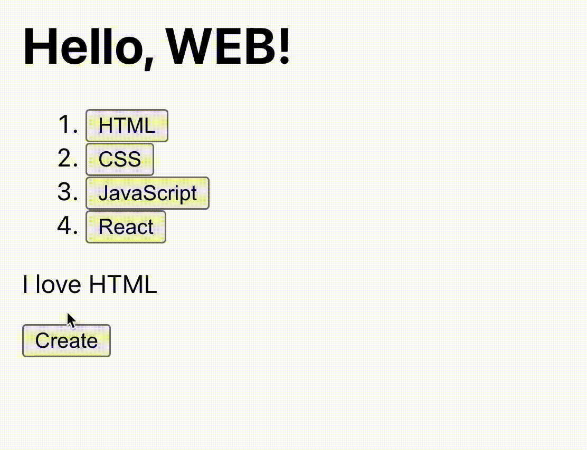
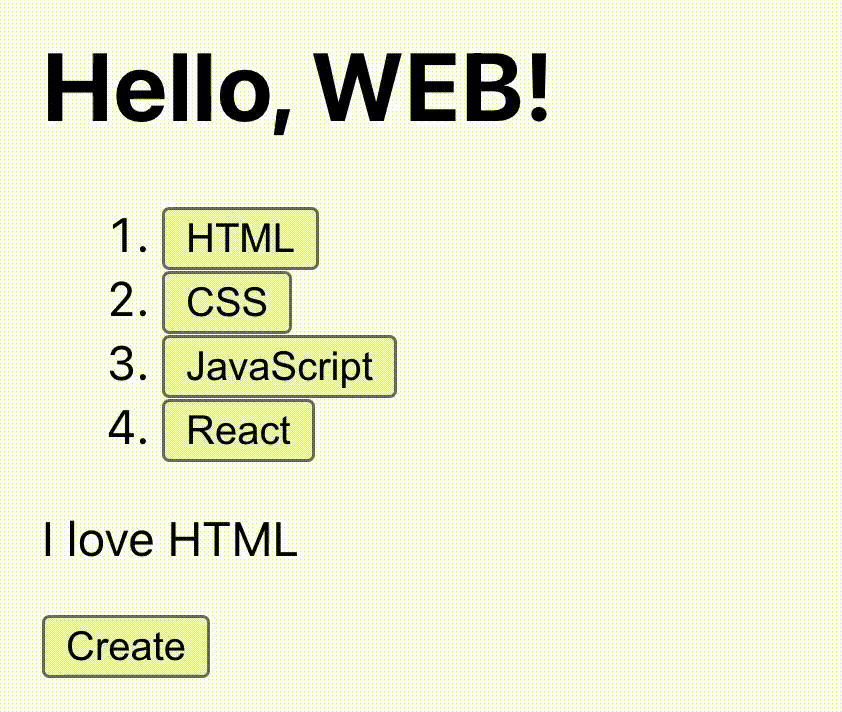
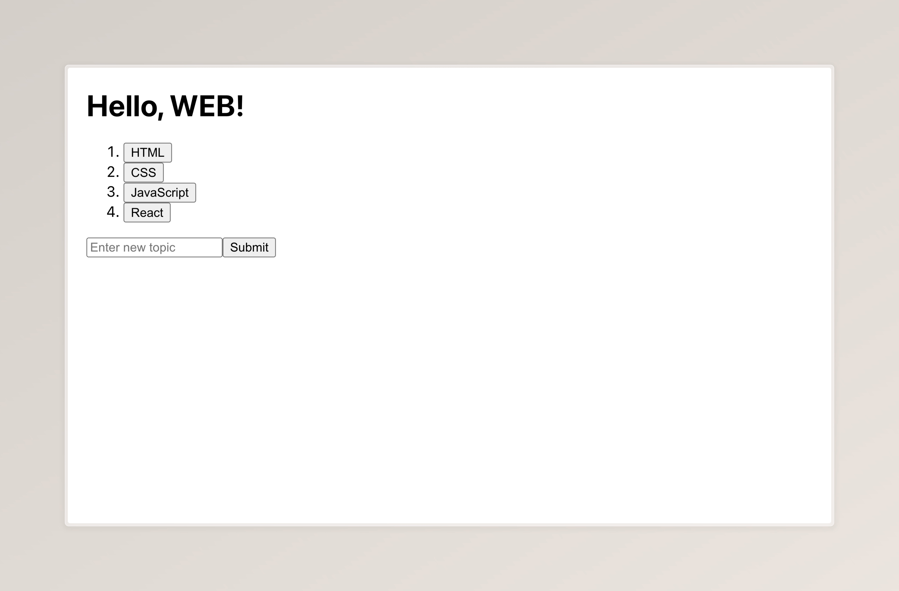

# Chapter 4. 생성 기능 구현

## 기반 다지기

정보를 단순히 보여주기만 하는 웹의 시대는 끝났습니다. 시대의 변화에 발맞춰 이제는 이용자들이 직접 목차를 생성할 수 있도록 해보겠습니다. 아래 GIF처럼 말이죠.


우선, 지금까지 네 개의 목차들을 저장하고 있던 `index` 변수를 **상태\(state\)** 로 바꿔보도록 하겠습니다. 목차가 추가된다는 것은 이 `index`가 변경됨을 의미하고, 변경된 이 변수가 즉각적으로 화면에 반영되도록 하기 위해서는 앞서 배운 '상태'라는 기술을 이용해야 하기 때문입니다.

```JavaScript
const index = ["HTML", "CSS", "JavaScript", "React"]; // 이 코드를

const [index, setIndex] = useState(["HTML", "CSS", "JavaScript", "React"]); // 이렇게 바꿔줍니다
```

그리고 `<p>I love {index[selected]}</p>` 바로 아래 줄에 'Create' 버튼도 만들어보도록 합니다. `onClick`을 지정하지 않았기 때문에 아직 클릭해도 아무 변화도 없을 거예요.

```HTML
<button>Create</button>
```

이제 우리는 `mode`라는 상태를 만들 것입니다. 이 상태 값에는 지금처럼 글 내용을 **보고 있는 화면**인지 혹은 이번에 추가할 기능인 글을 **추가하는 화면**인지를 저장합니다. 글을 보는 화면이라면 `view`를, 추가하는 화면이라면 `create`를 저장하도록 하죠. 이제 이 상태 값에 따라 상기한 GIF처럼 화면이 다르게 나타날 것입니다. 초기 화면, 즉 웹페이지를 들어오자마자 보는 화면은 'HTML 목차를 보고 있는 화면'이므로 `mode` 상태 값은 `view`가 되겠군요. `selected` 상태를 정의하는 코드 아래와 같이 코드를 추가해 줍니다.

```JavaScript
const [selected, setSelected] = useState(0); // 원래 있던 코드
const [mode, setMode] = useState("view");

return ( // 원래 있던 코드
```

다시 한번 앞서 제시한 GIF를 유심히 주의 깊게 살펴 보고, 보는 화면이 추가하는 화면으로 바뀌는 순간과 그 반대의 순간이 언제인지를 정리해 봅시다.

1. 'Create' 버튼을 클릭할 때 (보는 화면 → 추가하는 화면)
2. 추가하는 화면에서 목차(`HTML` 등) 클릭할 때 (추가하는 화면 → 보는 화면)
3. 추가하는 화면에서 새 이름 입력 후 'Create' 버튼을 클릭할 때 (추가하는 화면 → 보는 화면. 이 경우 `selected`도 바뀜)

아직 우리는 보는 화면만 만들었으므로 1번만 구현해 보도록 합시다. 위에서 만든 'Create' 버튼을 클릭하면 이 `mode` 상태 값이 바뀌어야 하는 것이죠. 아래와 같이 기존에 만들었던 Create 버튼을 수정해 봅니다.

```JavaScript
<button
  onClick={() => {
    setMode("create");
  }}
>
  Create
</button>
```

## AND(`&&`) 연산자와 `<></>`

여기까지 잘 따라오셨을 것이라 믿습니다. 하지만 아무리 Create 버튼을 클릭해 봤자 조용할 따름입니다. `mode` 상태 값에 따라 화면이 전환되는 것을 구현하지 않았기 때문이죠. 이제 이 부분을 구현해 봅시다.

`I love HTML` 부분과 Create 버튼은 추가하는 화면에서는 사라져야 합니다. 다시 말해서 '보는 화면'에서만 보여야 한다는 것이죠. 원래라면 이러한 조건 분기[조건(여기서는 `mode` 상태 값에 따라)에 따라 분기(결과가 나뉘는)되는 것]는 if문이나 switch문을 이용해 처리해야 합니다. 하지만 이런 if문과 switch문은 map 함수와 달리 HTML 태그 안에 `{`과 `}`로 넣을 수 없습니다.(그 이유는 나중에 다루겠습니다.) 즉, 아래와 같은 문법은 허용되지 않는다는 것이죠.

```JavaScript
return (
  <div>
    <h1>Hello, WEB!</h1>
    <ol>
      {index.map((x, i) => {
        return (
          <li key={i}>
            <button
              onClick={() => {
                setSelected(i);
              }}
            >
              {x}
            </button>
          </li>
        );
      })}
    </ol>
    {
      if(mode === "view") { // 허용되지 않는 문법
        return (
          <p>I love {index[selected]}</p>
          <button
            onClick={() => {
              setMode("create");
            }}
          >
            Create
          </button>
        )
      }
    }
  </div>
);
```

JavaScript에서 AND(`&&`) 연산자는 아래와 같이 활용할 수 있습니다. 이 예제에서는 `a` 변수가 참이라면 `123`을 반환합니다.

```JavaScript
a && 123
```

즉, AND 연산자 앞의 값이 참이면 뒤의 값을 반환한다는 것이죠. 한편 AND 연산자 앞의 값이 거짓이라면 뒤의 값을 거치지 않고 단순히 앞의 값을 반환합니다.

여기서 참과 거짓은 `true`와 `false`에 한정되지 않습니다. `null`과 `NaN`, `0`, `undefined`, 빈 문자열 등은 JavaScript에서 거짓으로 취급되며, `abc`와 같은 문자열부터 함수, `3`이나 `-4`와 같은 `0`이 아닌 숫자, `[1, 2, 3]`과 같은 배열 등은 참으로 취급됩니다.

몇 가지 예제를 통해 이해해 봅니다. 자세한 명세는 [여기](https://developer.mozilla.org/ko/docs/Web/JavaScript/Reference/Operators/Logical_AND)를 참고합니다.

```JavaScript
123 && 0 // 123은 참이므로 0 반환
"" && "Hello" // 빈 문자열은 거짓이므로 빈 문자열 반환

const thisisme = {"name": "mjun0328", "age": 20};
thisisme && "Hello, " + thisisme // thisisme는 참이므로 "Hello, mjun0328" 반환
```

이제 AND 연산자를 이용해 아래와 같이 if문을 대체해 봅시다. `mode` 상태 값이 `view`라면 이 값이 참이 될 것이므로 `<p>` 태그와 `<button>` 태그가 나타날 것입니다.

```JavaScript
return (
  <div>
    <h1>Hello, WEB!</h1>
    <ol>
      {index.map((x, i) => {
        return (
          <li key={i}>
            <button
              onClick={() => {
                setSelected(i);
              }}
            >
              {x}
            </button>
          </li>
        );
      })}
    </ol>
    {mode === "view" && (
      <p>I love {index[selected]}</p>
      <button
        onClick={() => {
          setMode("create");
        }}
      >
        Create
      </button>
    )}
  </div>
);
```

그런데 에러 메시지가 나타납니다. JSX(JavaScript에서 HTML 태그를 다루는 문법)에서는 오직 하나의 요소를 반환해야 하는데, 우리는 `<p>` 태그와 `<button>` 태그로 두 개의 요소를 반환했기 때문입니다. 여기서 말하는 '하나의 요소'에는 `<p>Hello</p>`처럼 오직 한 개의 요소이거나 `<div><p>Hello</p><p>React</p></div>`처럼 여러 태그여도 하나의 부모 요소로 감싼 경우가 해당합니다. 우리는 여러 태그를 반환해야 하기에 후자처럼 하나의 부모 요소로 태그를 감쌀 필요가 있어 보입니다. 아래처럼 말이죠. 물론 `div`로만 감싸라는 법은 없습니다. `p` 태그가 될 수도 있고 심지어는 `button`으로 감싸는 것도 가능하죠.

```JavaScript
{mode === "view" && (
  <div>
    <p>I love {index[selected]}</p>
    <button
      onClick={() => {
        setMode("create");
      }}
    >
      Create
    </button>
  </div>
)}
```

그런데 이렇게 여러 태그를 반환할 때마다 `<div>`와 같이 어떤 태그로 감싸는 것은 여러모로 귀찮은 일입니다. CSS를 다시 설정해야 할 수도 있고 불필요하게 많은 태그가 생기기 때문이죠. 이를 위해 React에서는 `Fragment`로 불리는 '빈 태그'라는 개념이 있습니다. 우리는 이 `Fragment` 태그를 이용하여 여러 태그를 감쌀 수 있습니다. 아래처럼 말이죠.

```JavaScript
{mode === "view" && (
  <Fragment>
    <p>I love {index[selected]}</p>
    <button
      onClick={() => {
        setMode("create");
      }}
    >
      Create
    </button>
  </Fragment>
)}
```

다만, `Fragment`는 `useState`처럼 JavaScript 문법이 아닌 React 문법이기에 `useState`처럼 맨 윗 줄에 아래와 같이 가져온다는 코드를 작성해야 합니다.

```JavaScript
import { Fragment } from "React";
```

기존 `import { useState } from "React";` 코드와 함께 적고 싶다면 아래처럼 작성할 수 있습니다.

```JavaScript
import { Fragment, useState } from "React"; // Fragment와 useState 간의 순서는 상관 없습니다.
```

이 빈 태그는 실제 HTML에 적용될 때 없는 것으로 취급됩니다. 아까처럼 `<div>` 태그로 감싼 경우와 `Fragment` 태그로 감싼 경우를 비교해 봅시다.

```JavaScript
return (
  <ol>
    <li>A</li>
    <li>B</li>
    {
      true && (
        <div>
          <li>C</li>
          <li>D</li>
        </div>
      )
    }
    <li>E</li>
    <li>F</li>
    {
      true && (
        <Fragment>
          <li>G</li>
          <li>H</li>
        </Fragment>
      )
    }
    <li>J</li>
  </ol>
);
```

예컨대 위와 같은 React 코드는 실제 HTML로 동작할 때 아래와 같이 처리됩니다.

```HTML
<ol>
  <li>A</li>
  <li>B</li>
  <div>
    <li>C</li>
    <li>D</li>
  </div>
  <li>E</li>
  <li>F</li>
  <li>G</li>
  <li>H</li>
  <li>J</li>
</ol>
```

`<div>`로 감싼 경우에서는 태그가 그대로 남아 새 계층이 생긴 반면, `<Fragment>`로 감싼 경우에서는 그렇지 않음을 확인할 수 있습니다.

`<Fragment></Fragment>`는 `<></>`로 간단하게 표현할 수 있으며, `<></>`는 `<Fragment>`와 달리 import할 필요가 없다는 장점이 있습니다. 아래 코드로 빈 태그 개념을 정리하고 다음으로 넘어가도록 하겠습니다.

```JavaScript
{mode === "view" && (
  <>
    <p>I love {index[selected]}</p>
    <button
      onClick={() => {
        setMode("create");
      }}
    >
      Create
    </button>
  </>
)}
```

이제 Create 버튼을 누르면 아래 GIF처럼 `I love HTML` 부분과 Create 버튼이 사라지는 것을 확인할 수 있습니다. 여기까지 보는 화면에서의 구현은 끝났습니다.



[소스코드 변경 사항](https://github.com/mjun0328-study/Course_React/commit/e008866fbaeb6c515992138735450c67133f747c)

## input 활용 방법 익히기

앞서 `mode` 상태 값이 `view`일 때의 화면을 구현했다면, 이번에는 상태 값이 `create`일 때, 즉 추가하는 화면을 구현해 보겠습니다.

우선, 아래와 같이 코드를 추가하여 입력란과 Submit 버튼을 구현해 봅니다. 예쁘게 플레이스홀더(placeholder)도 적어 주도록 합니다.

```JavaScript
        </button>
      </>
    )} // 여기까지 원래 있던 코드
    {mode === "create" && (
      <>
        <input placeholder="Enter new topic" />
        <button>Submit</button>
      </>
    )}
  </div> // 여기부터 원래 있던 코드
);
```

아주 만족스러운 추가하기 화면이 구축되었습니다.


아주 중요한 걸 배워볼 겁니다. 바로 input 태그를 사용하는 방법이죠. 웹페이지에서 사용자의 입력을 받을 일은 수없이 많습니다. 로그인 화면에서 아이디와 비밀번호를 받을 때, 검색란에서 검색할 키워드를 받을 때, 채팅창에서 보낼 채팅을 적을 때가 모두 그 예입니다.

React에서 input 태그를 다루는 방법은 좀 특이합니다. 입력할 때마다 즉각적으로 화면에 적용되다 보니 상태(state)를 이용해야 하죠. 사용자가 무언가를 입력하면 그 입력값이 상태 값으로 저장되고, 그 상태 값이 input 태그의 `value`로 전달되는 방식입니다. 예제를 통해 이해해 봅니다.

```JavaScript
const [name, setName] = useState("홍길동");

return <input value={name} onChange={(e) => {
  setName(e.target.value)
}} />
```

위 예제에서 사용자가 input 태그에 무언가를 입력했을 때 그 값이 input 태그에 적용되기까지의 과정은 아래와 같습니다.

1. `value={name}` 코드에 의해 `홍길동`이 input 태그에 적혀 있습니다.
2. 사용자가 무언가를 입력하면 `onChange` 이벤트가 실행됩니다.
3. `setName(e.target.value)`에 의해 input 태그에 입력된 값이 `name` 상태 값으로 저장됩니다.
4. 다시 `value={name}` 코드에 의해 그 값이 input 태그에 적용됩니다.

input 태그에 사용되는 상태도 결국 앞서 배운 상태와 같은 것이기에 다른 부분에서 `setName` 함수를 이용해 상태 값을 변경하더라도 input 태그에 그대로 적용됩니다.

우리는 앞서 만든 input의 값을 `topic`이라는 상태로 처리하도록 하겠습니다. 아래와 같이 코드를 추가합니다.

```JavaScript
const [mode, setMode] = useState("view"); // 원래 있던 코드
const [topic, setTopic] = useState("");

return ( // 원래 있던 코드
```

앞서 만든 input 태그도 아래와 같이 수정해 줍니다.

```JavaSript
<input
  value={topic}
  onChange={(e) => {
    setTopic(e.target.value);
  }}
  placeholder="Enter new topic"
/>
```

여기까지 잘 따라왔다면 input에 값이 잘 입력되는 것을 확인할 수 있습니다.

[소스코드 변경 사항](https://github.com/mjun0328-study/Course_React/commit/ca64b1c087989cf04d620c7927275263b8c4830b)

## 나머지 로직 구현하기

이제 나머지 로직도 구현해 생성 기능 제작을 마무리해 봅시다. 중요하게 다룰 부분은 없으니 빠르게 넘어가도록 하겠습니다.

목차를 추가하는 화면에서 Submit 버튼을 눌렀을 때 발생하는 일들을 정리하면 다음과 같습니다.

1. `selected` 상태 값을 새로 만든 목차로 변경합니다.(새로 만든 목차가 나타나게끔)
2. 입력된 값을 `index` 상태 값 배열에 추가하기
3. `mode` 상태 값을 `view`로 전환하기

```JavaScript
<button
  onClick={() => {
    setSelected(index.length); // 1번
    setIndex((prev) => { // 여기부터
      prev.push(topic);
      return prev;
    }); // 여기까지 2번
    setMode("view"); // 3번
  }}
>
  Submit
</button>
```

여기까지 만들면 원하는 대로 목차가 잘 추가되는 것을 확인할 수 있습니다.

다음으로 '추가하는 화면에서 목차를 클릭했을 때 `view` 모드로 전환하기'를 구현해 봅니다. 목차 부분을 아래와 같이 수정해 줍니다.

```JavaScript
return (
  <li key={i}>
    <button
      onClick={() => {
        setSelected(i);
        setMode("view"); // 추가된 부분
      }}
    >
      {x}
    </button>
  </li>
);
```

마지막으로 한 번 생성한 후 다시 Create 버튼을 눌렀을 때 input 태그의 값이 초기화되도록 Create 버튼 부분을 아래와 같이 수정해 주고 생성 기능 구현을 마무리해 보겠습니다.

```JavaScript
<button
  onClick={() => {
    setMode("create");
    setTopic("");
  }}
>
  Create
</button>
```

여기까지 생성 기능을 완성했습니다. 비록 새로고침 되면 만든 목차들이 다시 원래대로 돌아오기는 하지만 우리는 생성 기능이라는 웹페이지의 첫 삽을 떴습니다. 이제 생성 기능을 마음껏 음미하며 다음 수업으로 넘어가 보도록 하겠습니다. 수고하셨습니다.

[소스코드 변경 사항](https://github.com/mjun0328-study/Course_React/commit/f68f19e7642bece2caeee4202a6410a65a5e2523)
