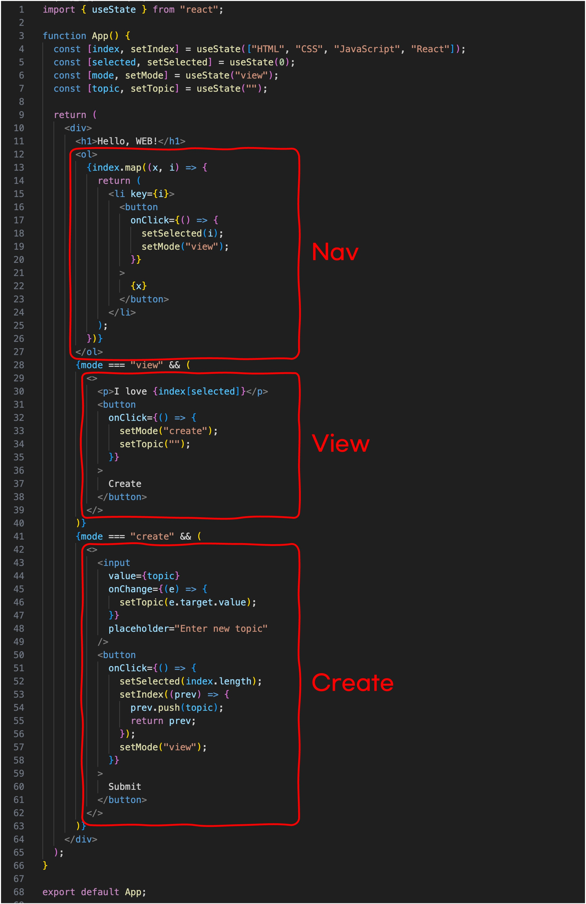
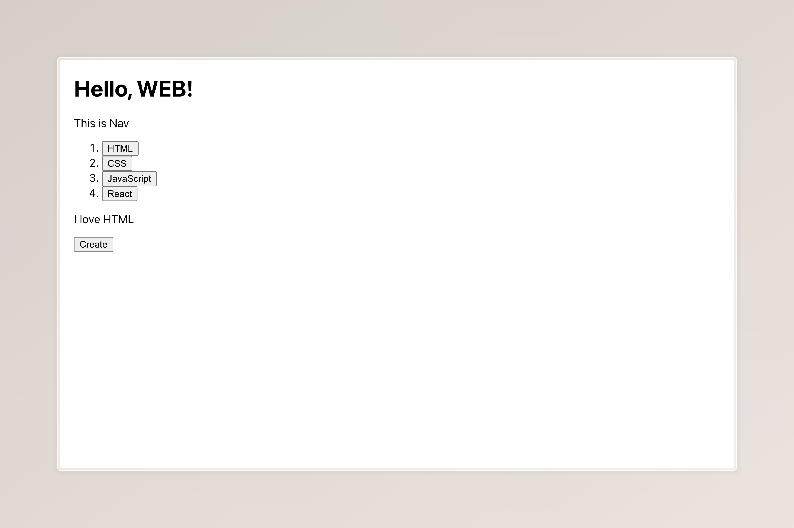
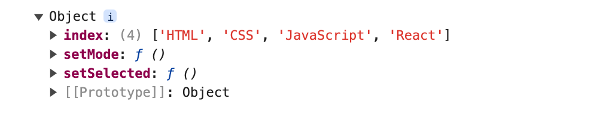

# Chapter 5. 컴포넌트와 props로 리팩토링하기

## 리팩토링의 필요성

무릇 모든 일에는 걸음을 멈춰 이제까지 걸어온 길을 되돌아보는 시기가 있는 법입니다. 갑자기 왜 이런 철학적인 이야기를 하느냐고요? 이 법칙은 코딩 세계에도 적용되기 때문입니다. 단순히 자신을 되돌아보라는 교양적인 이야기를 하려는 게 아닙니다. 정말로 자신이 짠 '코드'를 되돌아보라는 의미입니다. 지금까지 우리는 `App`이라는 함수에서 모든 것을 구현해 왔습니다. 하지만 웹페이지의 규모가 점차 커질수록 하나의 함수에서 모든 기능과 화면을 구현하는 것은 불가능에 가까워집니다. 변수와 상태의 이름은 겹칠 것이고, 코드들의 위치도 자유분방해져 찾기도 어려워지죠. 점차 스파게티처럼 이리저리 꼬이기 마련일 것입니다. 무엇보다 가시성이 떨어지고 유지 보수에도 어려움이 따라옵니다.

## 컴포넌트로 분해하기

React의 강점 중 하나는 이런 웹페이지를 레고 블록처럼 나누고 붙이고 할 수 있다는 점입니다. 지금까지 우리가 만든 코드들을 아래와 같이 세 개의 블록으로 분해해 보겠습니다.



블록으로 나누기에 앞서 지금까지 우리가 수차례 다뤘던 `App` 함수의 구조를 파악해 봅니다. 코드들을 정리해 보면 결국 이 `App` 함수는 아래와 같은 구조로 되어 있음을 알 수 있습니다. 함수 내에 여러 코드가 있고, 결국 반환(return)되는 HTML 코드가 화면에 보여지는 것입니다.

```JavaScript
function App() {
  // 코드 이것저것 (useState 등)

  return (
    // 화면에 보여지는 HTML
  )
}
```

React에서는 이 블록을 '컴포넌트(component)'라고 부르는데, `App` 함수도 하나의 컴포넌트입니다. 이 때문에 우리가 만들 블록, 즉 컴포넌트들도 위 `App`의 구조를 따라갑니다. 백문이 불여일견으로, 직접 만들어보며 익혀 나가도록 하겠습니다. `App` 함수 바로 위에 `Nav` 함수를 아래와 같이 만들어 봅니다. 컴포넌트 이름은 첫 글자가 대문자여야 합니다! `nav`가 아닌 `Nav`인 점 유의하세요.

```JavaScript
import { useState } from "react"; // 원래 있던 코드

function Nav() {
  return <p>This is Nav</p>;
}

function App() { // 여기부터 원래 있던 코드
  const [index, setIndex] = useState(["HTML", "CSS", "JavaScript", "React"]);
```

방금 우리가 만든 `Nav` 컴포넌트를 호출해 봅시다. JavaScript에서 함수를 실행할 때는 `Nav()`와 같이 작성해야 하지만, HTML 내에서 컴포넌트를 호출할 때는 `<Nav />` 혹은 `<Nav></Nav>`와 같이 작성하여야 합니다. 한번 호출해 봅시다. `App` 함수 내에서 원하는 위치에 `Nav` 컴포넌트를 호출해 봅니다. 저는 아래와 같이 작성해 호출하도록 하겠습니다.

```JavaScript
return (
  <div>
    <h1>Hello, WEB!</h1> // 여기까지 원래 있던 코드
    <Nav />
    <ol> // 여기부터 원래 있던 코드
      {index.map((x, i) => {
        return (
```

아래 사진과 같이 원하는 대로 `Nav` 컴포넌트가 잘 나오는 것을 확인할 수 있습니다.


이제 본격적으로 목차 부분인 Nav 블록을 아래와 같이 `Nav` 컴포넌트로 이주시켜 보겠습니다. 기존 `App` 컴포넌트의 `<ol>`부터 `</ol>`까지의 코드를 그대로 잘라 내어 `Nav` 컴포넌트에 붙여 넣기만 하면 됩니다. 그리고 기존에 목차가 있던 자리에는 `<Nav />`를 작성하여 컴포넌트를 호출하도록 합니다.

```JavaScript
import { useState } from "react";

function Nav() {
  return (
    <ol>
      {index.map((x, i) => {
        return (
          <li key={i}>
            <button
              onClick={() => {
                setSelected(i);
                setMode("view");
              }}
            >
              {x}
            </button>
          </li>
        );
      })}
    </ol>
  );
}

function App() {
  const [index, setIndex] = useState(["HTML", "CSS", "JavaScript", "React"]);
  const [selected, setSelected] = useState(0);
  const [mode, setMode] = useState("view");
  const [topic, setTopic] = useState("");

  return (
    <div>
      <h1>Hello, WEB!</h1>
      <Nav /> // 수정된 부분
      {mode === "view" && (
        <>
          <p>I love {index[selected]}</p>
```

잘 작동될 거라는 기대와 달리 에러가 무려 세 개나 발생했다면 여기까지 잘 따라온 것입니다. 아래에서 이 에러를 해결하는 방법에 대해 알아보도록 합니다.

[소스코드 변경 사항](https://github.com/mjun0328-study/Course_React/commit/c92ff64fbf0473d88b86098e0d32843e233cfcfd)

## props의 이해

```
src/App.js
  Line 6:8:    'index' is not defined        no-undef
  Line 11:17:  'setSelected' is not defined  no-undef
  Line 12:17:  'setMode' is not defined      no-undef
```

앞서 발생한 세 오류는 모두 말 그대로 `index`와 `setSelected`, `setMode`가 정의되지 않아 발생하는 에러입니다. `Nav` 컴포넌트가 `App` 컴포넌트에서 호출되긴 했어도 이 두 컴포넌트는 엄연히 분리된 별개의 컴포넌트입니다. 지금 우리 상황에서는 `App` 컴포넌트에서 선언된 `index`, `setSelected`, `setMode` 변수(함수)를 `Nav` 컴포넌트에서 사용하려 하였기 때문에 정의되지 않았다고 에러가 나타나는 것입니다. 마치 아래 예제와 같은 상황인 것이죠. 왜 `undefined`가 아닌 빈 문자열이 나오는지에 관해서는 JavaScript의 [일시적 사각지대(Temporal Dead Zone, TDZ)](https://developer.mozilla.org/ko/docs/Web/JavaScript/Reference/Statements/let)를 참조할 수 있습니다. 여기서는 단순히 원하는 대로 `name`이 출력되지 않음을 이해하면 됩니다.

```JavaScript
function Nav() {
  console.log(name); // name이 정의되지 않음!
}

function App() {
  const name = "React";
  Nav();
}

App();

// output: 빈 문자열
```

위 예제를 해결하는 방법은 간단합니다. 아래처럼 함수를 호출할 때 `name` 값을 같이 넘겨주는 것이죠.

```JavaScript
function Nav(name) {
  console.log(name);
}

function App() {
  const name = "React";
  Nav(name);
}

App();

// output: React
```

이제 본격적으로 에러를 해결해 봅시다. 위 방식처럼 `Nav` 컴포넌트를 호출할 때도 그 세 변수(함수)를 함께 넘겨주면 됩니다. JavaScript에서는 `Nav(name)`처럼 인자를 담아 호출할 수 있는 반면, React에서는 `<Nav name="React" />`와 같이 인자를 담아 호출할 수 있습니다. `Nav` 컴포넌트를 호출하는 코드를 아래와 같이 수정해 줍시다. 이렇게 호출 때 같이 넘겨주는 인자를 React에서는 property의 약자인 `props`라고 부릅니다.

```JavaScript
<Nav index={index} setSelected={setSelected} setMode={setMode} />
```

세 props 중 대표로 `index={index}`를 살펴보겠습니다. 같은 단어가 두 번 나와 이해하기 어려울 수 있겠지만 `index` 변수를 `index`라는 이름으로 넘겨주겠다는 의미를 갖습니다. 여기서 이름이란 호출되는 컴포넌트(여기서는 `Nav`)가 받을 props의 이름을 의미합니다. `abc={index}`라고 작성했다면 호출된 `Nav` 컴포넌트에서는 `abc`로 `index` 값에 접근하게 되는 것입니다. 아래 몇 가지 예제를 보면서 이해해 봅니다.

```JavaScript
<Hello name="홍길동" /> // '홍길동'이라는 문자열을 'name'이라는 이름으로 넘겨줌
<Hello name={name} /> // name 변수를 'name'이라는 이름으로 넘겨줌
<Hello abc={name} /> // name 변수를 'abc'라는 이름으로 넘겨줌.
```

`App` 컴포넌트에서 props를 통해 세 변수를 넘겨주었습니다. 이제는 호출된 `Nav` 컴포넌트에서 넘겨진 props를 받아오는 작업을 해보겠습니다. `function Nav() {` 부분을 아래와 같이 수정해 줍니다.

```JavaScript
import { useState } from "react"; // 원래 있던 코드

function Nav(props) {
  return ( // 원래 있던 코드
```

호출 시 넘겨진 props들은 위와 같이 받아올 수 있습니다. 물론 `props`가 아닌 다른 이름으로 받아와도 문제는 없습니다. `function Nav(helloworld) {`도 가능하다는 것이죠. 어쨌든 `console.log(props)` 코드를 추가하여 이 props에 넘겨진 값들이 어떻게 담기는지 확인해 봅시다.

```JavaScript
function Nav(props) { // 원래 있던 코드
  console.log(props);
  return ( // 원래 있던 코드
```



우리가 넘긴 세 개의 props가 잘 전달된 것을 확인할 수 있습니다. 이때 props는 객체(Object)로 넘어오기에 `index`를 쓰고 싶다면 `props.index`와 같이 사용해야 합니다. 이 점을 참고하여 아래와 같이 코드를 수정하여 오류를 해결해 봅니다.

```JavaScript
function Nav(props) {
  return (
    <ol>
      {props.index.map((x, i) => { // index가 props.index로 수정됨
        return (
          <li key={i}>
            <button
              onClick={() => {
                props.setSelected(i); // setSelected가 props.setSelected로 수정됨
                props.setMode("view"); // setMode가 props.setMode로 수정됨
              }}
            >
              {x}
            </button>
          </li>
        );
      })}
    </ol>
  );
}
```

[소스코드 변경 사항](https://github.com/mjun0328-study/Course_React/commit/2bb16a47a616ef285b99f384d4da5282e6250221)

### props를 다루는 또 다른 방법

props를 사용하는 한 가지 방법이 더 있는데, [구조 분해 할당](https://developer.mozilla.org/ko/docs/Web/JavaScript/Reference/Operators/Destructuring_assignment) 문법을 이용하는 것입니다. 이 문법에 대해 자세히 알지 못해도 문제없습니다. 간단히 설명하자면 아래와 같으나, 이해되지 않는다면 건너뛰어도 됩니다. 건너뛰실 분들은 아래 결론 부분만 보세요.

```JavaScript
const whoiam = {name: "홍길동", age: 20};
const {name, age} = whoiam;
console.log(name, age) // "홍길동" 20
```

예제 속 `whoiam`과 같은 객체가 있을 때, 그 객체의 속성명(여기서는 `name`, `age`)을 변수 이름으로 그대로 사용하고 그 속성값을 변수에 할당하고 싶다면, 즉 `whoiam`의 `name` 값을 `name`이라는 변수에 할당하고 싶다면 위의 문법을 이용할 수 있다는 것입니다. JavaScript는 센스 있게 변수 이름과 동일한 속성값을 찾아 할당해 줍니다.

**결론 - 건너뛰신 분들은 여기부터 계속**  
다시 본론으로 돌아와서, props를 사용하는 또 다른 한 가지 방법이란 앞서 배운 구조 분해 할당 문법을 이용하여 아래와 같이 사용하는 것입니다.

```JavaScript
// 이렇게 써야 하는 걸
function Nav(props) {
  let index = props.index;
  let setSelected = props.setSelected;
  let setMode = props.setMode;
  // ...
}

// 이렇게 간단히 쓸 수 있는 것이죠 <- 이게 구조 분해 할당 문법을 활용한 사례
function Nav({ index, setSelected, setMode }) {
  // ...
}
```

구조 분해 할당을 통해 props를 받으면 이전처럼 `props.index` 대신 아래처럼 간편하게 `index`로 사용할 수 있다는 장점이 있습니다. 자동으로 JavaScript에서 `index`라는 변수를 만들어 여기에 `props.index`를 저장하기 때문이죠. 나머지 두 props도 이렇게 동작하여 저장됩니다.

```JavaScript
function Nav({ index, setSelected, setMode }) {
  return (
    <ol>
      {index.map((x, i) => { // props.index 대신 index
        return (
          <li key={i}>
            <button
              onClick={() => {
                setSelected(i); // 여기도
                setMode("view"); // 마찬가지
              }}
            >
              {x}
            </button>
          </li>
        );
      })}
    </ol>
  );
}
```

[소스코드 변경 사항](https://github.com/mjun0328-study/Course_React/commit/b9d601691b80bceedfc62956688834516a3f101a)

둘 중 어느 방법을 써야 하냐에 그렇다고 할 정답은 없습니다. 두 방법 모두 서로 다른 장단점을 가지고 있고, 개인의 취향과 프로젝트의 규모, 컴포넌트 특성 등에 따라 갈라지기 때문이죠. 이 학습에서는 따끈따끈한 신(new)문법인 구조 분해 할당 방식을 사용하도록 하겠습니다.

## 나머지 코드도 이주시키기

이제 `Nav` 블록을 이주했으니, 남은 두 `View`와 `Create` 블록을 이주시켜 보겠습니다. 아래와 같이 미리 준비를 해놓고 스스로 이주시켜 보도록 합니다. 여기서 팁은 `{mode === "view" && <>어쩌고저쩌고</>}`가 아닌 `<>어쩌고저쩌고</>`만 이주하는 걸 추천한다는 점입니다.

```JavaScript
    </ol>
  );
} // 여기까지 원래 있던 코드

function View() {
  // ...
}

function Create() {
  // ...
}

function App() { // 여기부터 원래 있던 코드
  const [index, setIndex] = useState(["HTML", "CSS", "JavaScript", "React"]);
```

스스로 잘 만들어 보셨나요? 아래 코드를 참고하여 자신이 방금 직접 짠 코드와 비교해 보는 것도 좋을 것 같습니다.

[소스코드 변경 사항](https://github.com/mjun0328-study/Course_React/commit/1cf3b618c61447720f7556ab79d7a9927146dc4a)

```JavaScript
import { useState } from "react";

function Nav({ index, setSelected, setMode }) {
  return (
    <ol>
      {index.map((x, i) => {
        return (
          <li key={i}>
            <button
              onClick={() => {
                setSelected(i);
                setMode("view");
              }}
            >
              {x}
            </button>
          </li>
        );
      })}
    </ol>
  );
}

function View({ index, selected, setMode, setTopic }) {
  return (
    <>
      <p>I love {index[selected]}</p>
      <button
        onClick={() => {
          setMode("create");
          setTopic("");
        }}
      >
        Create
      </button>
    </>
  );
}

function Create({ index, setIndex, setSelected, setMode, topic, setTopic }) {
  return (
    <>
      <input
        value={topic}
        onChange={(e) => {
          setTopic(e.target.value);
        }}
        placeholder="Enter new topic"
      />
      <button
        onClick={() => {
          setSelected(index.length);
          setIndex((prev) => {
            prev.push(topic);
            return prev;
          });
          setMode("view");
        }}
      >
        Submit
      </button>
    </>
  );
}

function App() {
  const [index, setIndex] = useState(["HTML", "CSS", "JavaScript", "React"]);
  const [selected, setSelected] = useState(0);
  const [mode, setMode] = useState("view");
  const [topic, setTopic] = useState("");

  return (
    <div>
      <h1>Hello, WEB!</h1>
      <Nav index={index} setSelected={setSelected} setMode={setMode} />
      {mode === "view" && (
        <View
          index={index}
          selected={selected}
          setMode={setMode}
          setTopic={setTopic}
        />
      )}
      {mode === "create" && (
        <Create
          index={index}
          setIndex={setIndex}
          setSelected={setSelected}
          setMode={setMode}
          topic={topic}
          setTopic={setTopic}
        />
      )}
    </div>
  );
}

export default App;
```

이제 마지막으로 몇 가지만 다듬고 이번 장을 마치도록 하겠습니다. `topic` 상태는 `Create` 컴포넌트의 내부 일입니다. 쉽게 표현하자면 `topic` 상태는 `Create`라는 집의 '집안일'이라는 것이죠. input 태그에 입력되는 값인 `topic` 상태 값은 `Create` 컴포넌트 밖에서 접근할 필요도, 이유도 없습니다. `Create`의 집안일인 `topic` 상태를 `Create` 집으로 돌려주도록 하겠습니다. 아래 '소스코드 변경 사항'을 참고하여 따라 해 보도록 합니다.

[소스코드 변경 사항](https://github.com/mjun0328-study/Course_React/commit/33538328d113b9943397d8d861b4ea7dfed65f07)

이제 `topic`은 철저하게 `Create` 내부에서 선언되고 처리됨으로써 다른 컴포넌트와 격리되어 동작하게 됩니다. 외부에서 접근할 수도 없어지고 덕분에 상태 이름이 겹칠 우려도 사라졌죠. 이렇게 어떤 컴포넌트 내에서만 다뤄지는 상태들은 그 컴포넌트 안에서 선언하고 관리하는 게 좋습니다. 불필요하게 props로 넘겨줄 필요도 사라져 하나의 블록으로서의 장점을 극대화할 수 있기 때문이죠.

'기존에 `View` 컴포넌트에서도 `setTopic("")`이라고 해서 `topic` 상태를 사용했는데요?'라고 의문을 제기할 수 있을 것입니다. 기존에 우리는 `mode` 상태 값이 `create`로 전환될 때 `topic` 상태 값을 초기화하기 위해 `View` 컴포넌트에서 `setTopic` 함수를 사용했었습니다. 그런데 `{ mode === "create" && <Create /> }` 코드에 따라 `mode` 상태 값이 `create` 값으로 전환될 때 `Create` 컴포넌트가 실행됩니다. 우리가 만든 React 웹페이지를 새로고침하면 모든 상태가 초깃값으로 초기화되는 것처럼, `Create` 컴포넌트도 실행되는 순간 `const [topic, setTopic] = useState("");`이 실행되며 이 컴포넌트 내에서 선언된 모든 상태(여기서는 `topic`이 되겠죠)가 초깃값으로 돌아가게 됩니다. 따라서 별도로 `setTopic("")` 함수를 통해 초기화할 필요 없어졌기에 과감히 `View` 컴포넌트의 `setTopic("")` 부분을 삭제한 것입니다. 덕분에 `topic` 상태는 `Create` 컴포넌트에서만 사용하게 되었습니다.

그 복잡하던 코드가 블록으로 나뉘어 보기 편해졌습니다. 그 길던 `App` 컴포넌트 코드들은 20여 줄로 줄었습니다. 나중에 어떤 기능을 유지 보수하여야 할 때가 온다면 전체 코드를 분석할 필요 없이 그 기능을 담당하는 컴포넌트만 확인하면 됩니다. 한 번 만들어진 컴포넌트는 무한하게 재사용할 수 있기 때문에 여러 곳에서 여러 번 가져다 사용할 수도 있습니다. 똑같은 작업을 할 필요도, 똑같은 코드를 다시 짤 필요도 없다는 것이죠.

이제 우리는 [Chapter 2. 목차의 구현과 리액트 음미](./chap2.md#%EC%9D%8C%EB%AF%B8%ED%95%98%EA%B8%B0) 중 '음미하기' 영역을 이해할 수 있게 되었습니다. 다시 Chapter 2로 되돌아가 같은 코드를 모르고 보았을 때와 배우고 나서 볼 때의 차이를 경험해 보고 이를 한번 더 음미해 보며 지적 포만감에 빠져보도록 합니다. React 기초의 정상에 거의 다 다다랐음에 자긍심을 가지고 계속해서 나아가 봅시다.
